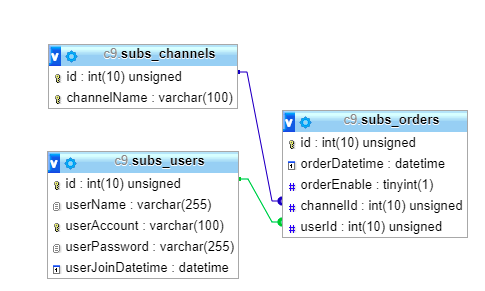

### 需求
 1) user 的基本資料 (userId, name) Create/Update
 2) 新聞頻道 (channelId, name) Create/Update ，name is unique
 3) 每個 user 都可以調整訂閱的新聞 Create/List/Update/Delete
 4) 每個 user 都可以訂閱多個新聞頻道，但是不能重複訂閱同一個頻道
 5) 每個 user 都可以取消訂閱指定的新聞頻道
 6) 查詢某頻道有哪些人訂閱 (input: channelId, output: List User)


### API

1) api/order GET
> 獲取所有訂閱

2) api/order POST
> 新增訂閱，會檢查使用者與頻道存不存在及是否重複訂閱同頻道，必要參數:

```javascript
[
'userAccount':'channelName',
'channelName':'channelName',
'orderEnable':'1',
'orderDatetime':'2019-02-23 00:00:00'
]
```
3) api/order/{userAccount} PUT
> 更新訂閱狀態(取消、啟用訂閱)，會檢查使用者與頻道存不存在，必要參數:

```javascript
[
'channelName':'channelName',
'orderEnable':'0'
]
```

4) api/order/{userAccount} DELETE
> 刪除訂閱，必要參數:

```javascript
[
'channelName':'channelName'
]
```

5) api/channel GET
> 獲取所有頻道

6) api/channel/{channelId} GET
> 獲取有訂閱特定頻道(channelId)的所有使用者資訊

7) api/channel POST
> 新增頻道，頻道名稱不可重複，必要參數:

```javascript
[
'channelName':'channelName',
]

```
8) api/channel/{channelName} DELETE
> 刪除頻道

9) api/user GET
> 獲取所有使用者

10) api/user/{userAccount} GET
> 獲取特定使用者所有訂閱資訊

11) api/user POST
> 新增使用者，帳號不可重複，必要參數:

```javascript
[
'userName':'userName',
'userAccount':'userAccount',
'userPassword':'userPassword',
'userJoinDatetime':'2019-02-23 00:00:00'
]

```
12) api/user/{userAccount} PUT
> 更改使用者資料，只能更改使用者加入時間，必要參數:

```javascript
[
'userJoinDatetime':'2019-02-23 12:00:00'
]

```

13) api/user/{userAccount} DELETE
> 刪除使用者

### DBSchema




